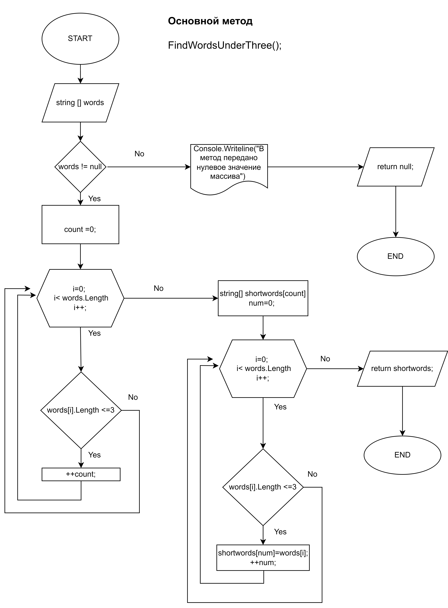

# Итоговая проверочная работа
## Этапы

1. *Создать репозиторий на GitHub*
2. *Нарисовать блок-схему алгоритма (можно обойтись блок-схемой основной содержательной части, если вы выделяете её в отдельный метод)*
3. *Снабдить репозиторий оформленным текстовым описанием решения (файл README.md)*
4. *Написать программу, решающую поставленную задачу*
5. *Использовать контроль версий в работе над этим небольшим проектом (не должно быть так, что всё залито одним коммитом, как минимум этапы 2, 3, и 4 должны быть расположены в разных коммитах)*  

***Задача:*** **Написать программу, которая из имеющегося массива строк формирует новый массив из строк, длина которых меньше, либо равна 3 символам. Первоначальный массив можно ввести с клавиатуры, либо задать на старте выполнения алгоритма. При решении не рекомендуется пользоваться коллекциями, лучше обойтись исключительно массивами.**

*Примеры:* 
 
>[“Hello”, “2”, “world”, “:-)”] → [“2”, “:-)”]  
>[“1234”, “1567”, “-2”, “computer science”] → [“-2”]  
>[“Russia”, “Denmark”, “Kazan”] → []'


### Описание решения.

#### В программе реализованы четыре метода:   
* ```string[] CreatArrFromKeyboardInString();```    
    * Обеспечивает ввод данных (символов и слов) пользователем с клавиатуры и формирование исходного массива типа ```string```.   
* ```string[] FindWordsUnderThree();```   
    * Принимает на вход сформированный массив с исходными данными, введенными пользователем и формирует новый массив, согласно условиям задачи.   
* ```void PrintArray();```   
    * Обеспечивает вывод массивов в консоль, на экран.   
* ```void BeepOnError();```   
    * Подает звуковой сигнал (только для Win платформ) в случае ошибки.   

#### Порядок работы:

1. Пользователь вводит с клавиатуры набор символов или слов, ввод обрабатывается методом ```CreatArrFromKeyboardInString();```, который возвращает значение введенного массива. В качестве разделителя значений (элементов) массива пользователь может использовать пробелы или следующие символы типа ```char```: ``'.' , ',' , ';' , '/'``.    
Пустые элементы последовательности удаляются.   
В методе предусмотено условие проверки ввода - если пользователь не ввел значения, метод возвращает ```null``` и выводит пользователю сообщение об ошибке.   
2. Переменной ```string [] words``` присваивается значение, возвращаемое методом ```CreatArrFromKeyboardInString();```
3. Метод ```FindWordsUnderThree();``` принимает значение ```string [] words```, т.е. элементы введенные пользователем в виде массива.   
 В методе содержаться два цикла ```for```: первый цикл определяет количество вхождений по условию задачи в первоначальном массиве и возвращает  измененное значение ```count```, ранее инициализированной переменной.    
 Далее полученное значение ```count``` используется для инициализации нового, результирющего массива ```string [] shortwords```, в качестве значения  его размера.   
 Второй цикл ```for``` педназначен для заполнения результирующего массива: по условию задачи присваивает значение индекса исходного массива с соответствующим вхождением, индексу результирующего массива по порядку. В качестве счетчика используется ранее инициализированная переменная ```num```.   
Указанный метод возвращает значения результирующего массива с отобранными по условию элементами первоначального массива. Если в метод передано значение ```null```, метод возвращает ```null``` и выводит соответствующее в консоль пользователю.   
Блок - схема, описывающая метод. 

4. Переменной ```string [] shortwords``` присваивается значение, возвращаемое методом ```FindWordsUnderThree();```

5. Метод ```PrintArray();``` предназначен для печати (вывода в консоль) значений передаваемого массива. Принимает в качестве значений значения массивов и при помощи цикла ```for``` выводит на печать. Если в метод передано значение ```null```, метод выводит сообщение об ошибке.
6. Значения ```words``` и ```shortwords``` передются в вызываемый метод ```PrintArray();``` для вывода результата по условиям задачи.

### Ссылки:

* [Основное решение](//MAINSOLUTION/Program.cs)
* [Альтернативное решение](//ALTERNATIVESOL/Program.cs)
* [Блок-схема](final.png)

### Блок-схема

